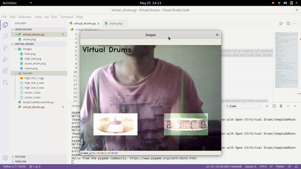

# Virtual Drums
[](http://hits.dwyl.com/navendu-pottekkat/virtual-drums)
[](https://github.com/navendu-pottekkat/virtual-drums/issues)
[](https://opensource.org/licenses/MIT)

This project use Open CV to create a virtual drum set. It uses color detection in a region of interest and plays the corresponding drum beat. The drums are shown in the video output and hitting the drums with a green object would make you able to virtually play it.

Do give a star if you liked this project!



## Installation

Clone and navigate into the directory. Install the required packages in your environment by using pip.

```bash
pip install -r requirements.txt
```

## Usage

Open the project folder after installing requirements and run:

```bash
python virtual_drums.py
```

## Contributing 
[](https://github.com/navendu-pottekkat/virtual-drums/issues)

You are free to use this code for any purpose. If you have built anything interesting, contribute it back to this project. You could add more drums and improve the overall performance.

## License
[MIT](https://choosealicense.com/licenses/mit/)
